#   MOD LIST FOR ZALUPA CRAFT 1.0

все моды работают нормально.

даже у меня на машине 60 - 70 FPS

## My Stack
> 1. NVidia GTX 1650(2Gib VRAM)
> 2. Intel Cone I-5 10400f
> 3. 8 Gib RAM
> 4. 500 Gib HDD
> 5. Ubuntu 22.04 LTS

>Graphics: 
>> 1. &#10003; Optifine
>> 2. &#10003; FPSReducer
>> 3. &#10003; Dynamic Lights
>> 4. &#10003; Dynamic Trees

>Utils:
>> 1. &#10003; NEI
>> 2. &#10003; CodeChickenCore
>> 3. &#10003; FTBUtils
>> 4. &#10003; FTBLib
>> 5. &#10003;Damage Indicators
>> 6. &#10003; Ambient Sounds 5
>> 7. &#10003; Item Physics
>> 8. &#10003; Xaero minimap
>> 9. &#10003; Baubles
>> 10. &#10003; CoFH Core
>> 11. &#10003; Enviromine
>> 12. &#10003; Veinminer
>> 13. &#10003; FTB Tweaks
>> 14. &#10003; Inventory Tweaks
>> 15. &#10003; Radix Core
>> 16. &#10003; Just Enough Calculation
>> 17. &#10003; Mine Tweaker 3
>> 18. &#10003; Forge Multipart
>> 19. &#10003; Baublecious
>> 20. &#10003; Coreutil
>> 21. &#10003; IChuntUtil
>> 22. &#10003; IGW-Mod
>> 23. &#10003; Open-ModsLib
>> 24. &#10003; Universal Mod Core
>> 25. &#10003; Ruins
>> 26. &#10003; Keeping Inventory
>> 27. &#10003; Malisis Core
>> 28. &#10003; Not Enough Pets
>> 29. &#10003; TuthMods
>> 30. &#10003; Gender
>> 31. &#10003; Lunatrius Core
>> 32. &#10003; Schematica
>> 33. &#10003; Chicken Chunks
>> 34. &#10003; Chunk pregeneration
>> 35. &#10003; RTG
>> 36. &#10003; Minecraft Comes Alive
>> 37 &#10003;. MrJPCore

> Engeeneering
>> 1. &#10003; Immersive engineering
>> 2. &#10003; Immersive Foundation
>> 3. &#10003; Buildcraft
>> 4. &#10003; Industrial Craft
>> 5. &#10003; Chisel
>> 6. &#10003; Wireless Industry
>> 7. &#10003; Tinkers Construct
>> 8. &#10003; Applied Engineering
>> 9. &#10003; Project Red(full modifications library)
>> 10. &#10003; Open Computers
>> 11. &#10003; Immersive Railroads
>> 12. &#10003; TrackAPI
>> 13. &#10003; RailCraft
>> 14. &#10003; Energy Control
>> 15. &#10003; RFTools
>> 16. &#10003; PhysicaNuclearPhysics
>> 17. &#10003; TMechworcs
>> 18. &#10003; ElectricalAge
>> 19. &#10003; CompactSolars
>> 20. &#10003; Mekanism

> Decor
> >1. &#10003;  Storage Drawers

> Seasons / Biomes
>> 1. &#10003; Serenes Seasons
>> 2. &#10003; Biomes'O'Plenty
>> 3. &#10003; Botania
>> 4. &#10003; Aquaculture 2
>> 5. &#10003; Aether 2
>> 6. &#10003; Thaumcraft
>> 7. &#10003; Tripicraft
>> 8. &#10003; Agricraft
>> 9. &#10003; TwilightForest
>> 10. &#10003; Dynamics Trees
>> 11. &#10003; Multipage Chest
>> 12. &#10003; CraftingTweaks
>> 13. &#10003; Forestry

> Other utils
>> 1. &#10003; Waypoints
>> 2. &#10003; Mantle
>> 3. &#10003; Iron Backpacks
>> 4. &#10003; Better builders wands
>> 5. &#10003; Iron Chests
>> 6. &#10003; Backpacks
>> 7. &#10003; Bookshelf
>> 8. &#10003; Better Furnaces
>> 9. &#10003; Weather

> Magic
>> 1. &#10003; Aether
>> 2. &#10003; Project E
>> 3. &#10003; TwilightForest
>> 4. &#10003; Forestry

> Other
>> 1. &#10003; Bibliocraft
>> 2. &#10003; Morpheous
>> 3. &#10003; Waila
>> 4. &#10003; extrautilities

> Food
>> 1. &#10003; Apples+

> Bonus
>> 1. &#10003; MineColonies(Может 3аработает у тебя)

Screens

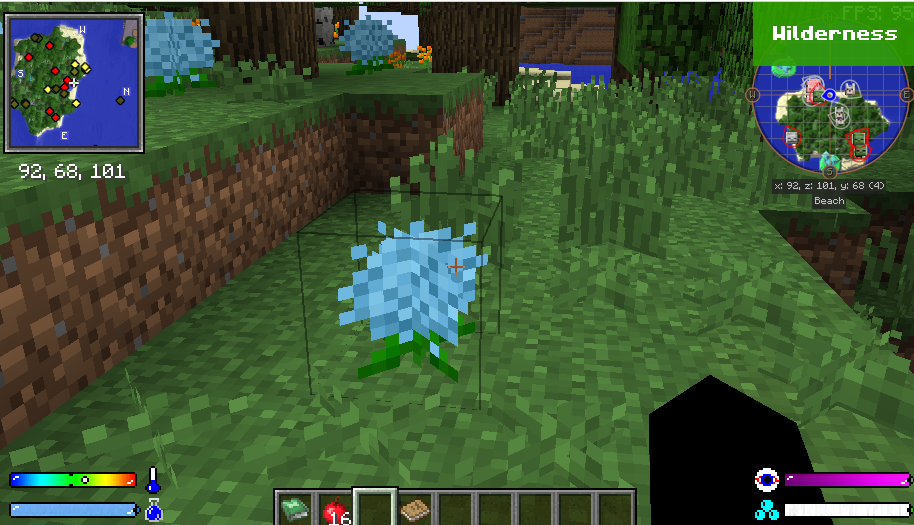
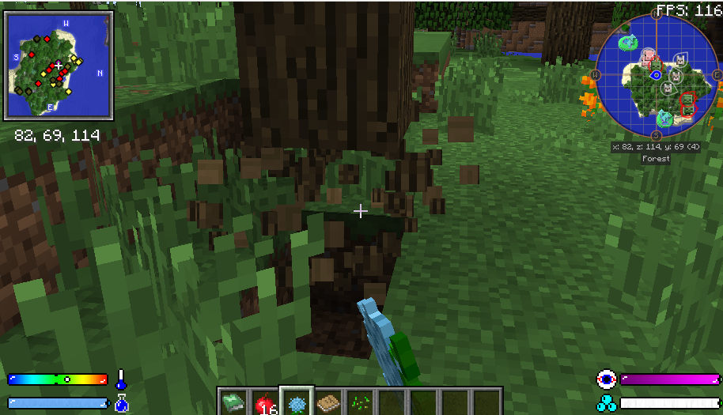
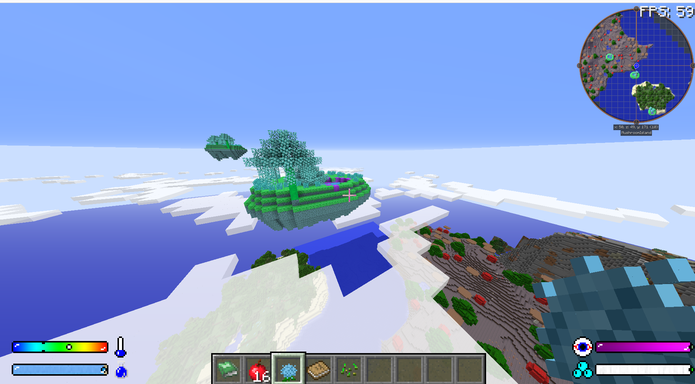
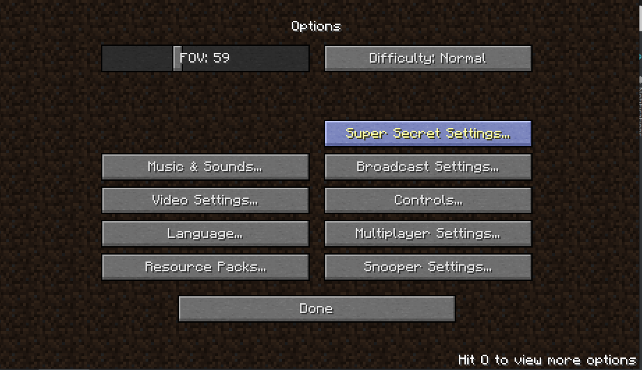
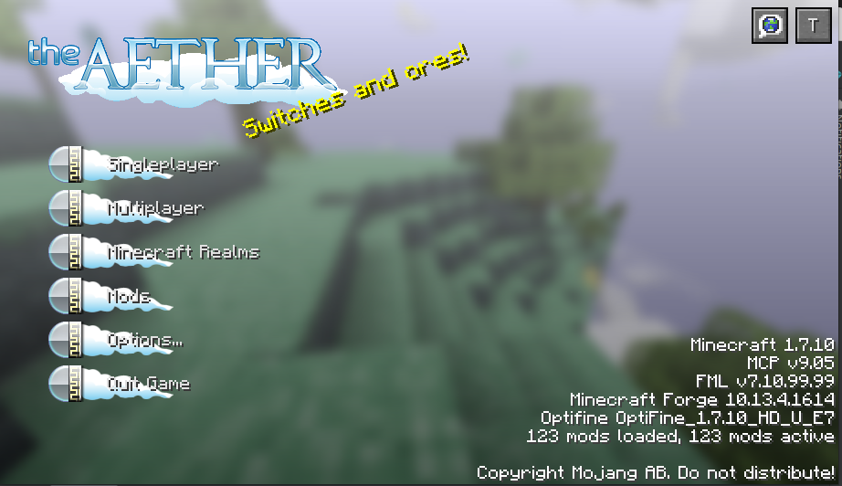
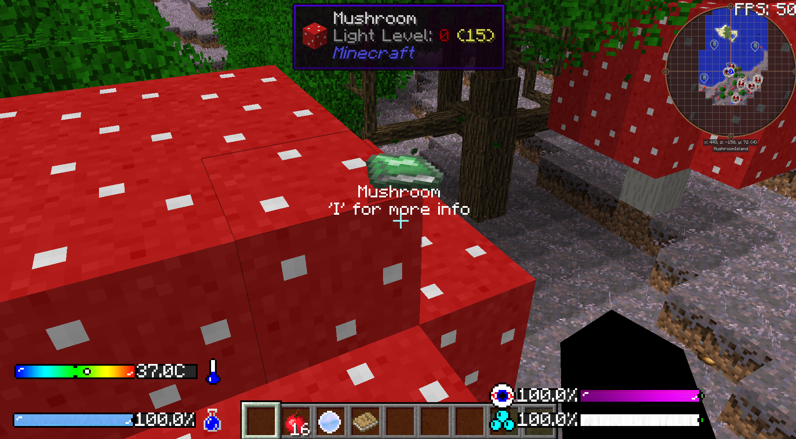
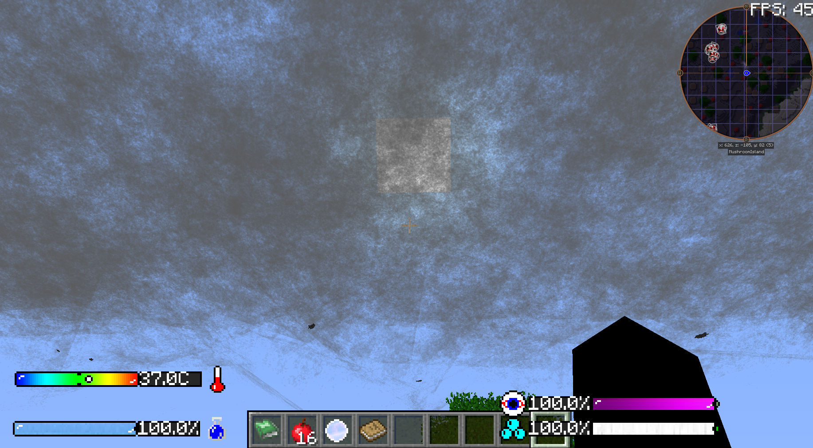
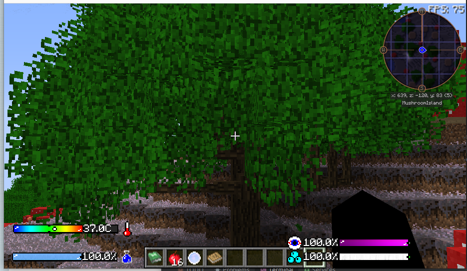

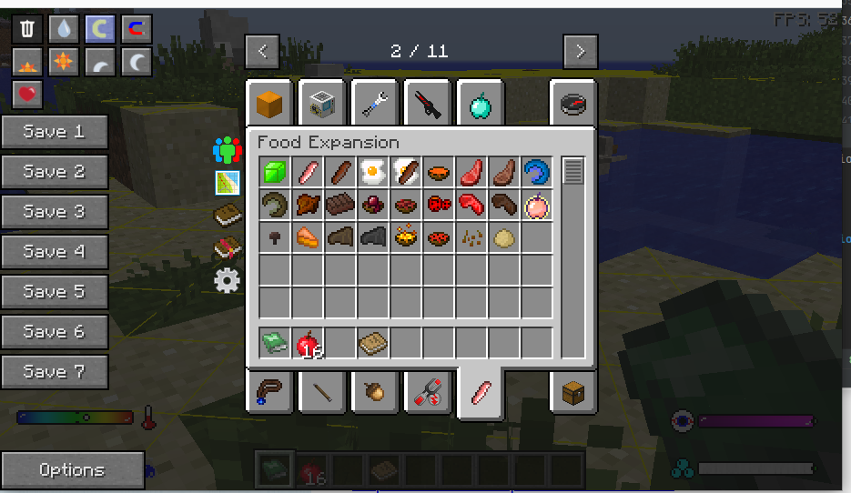
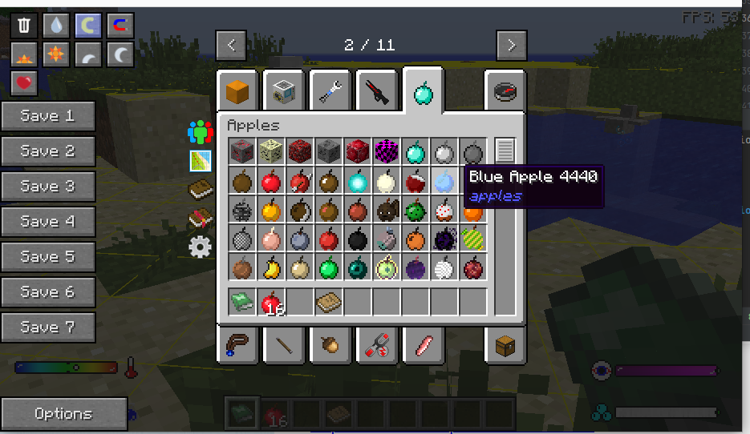
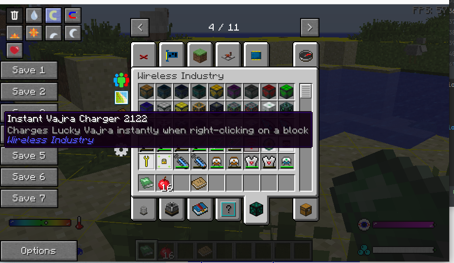
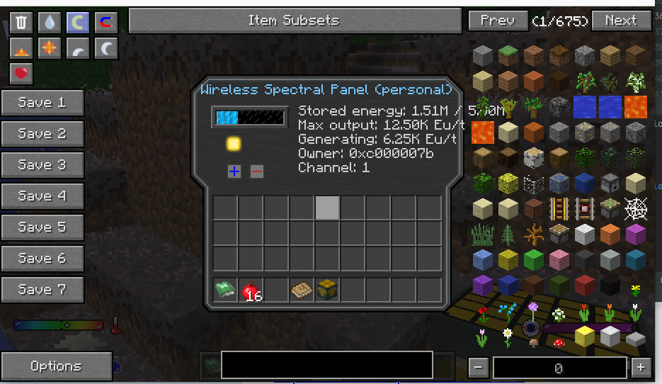

